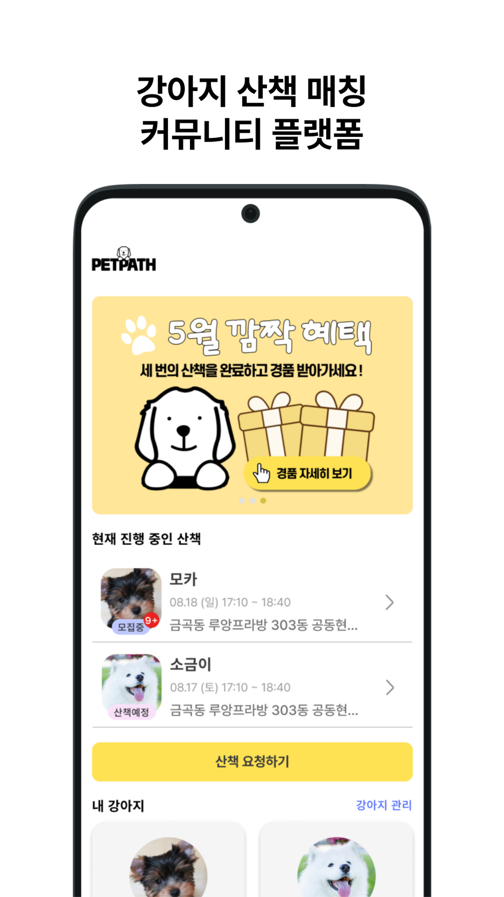
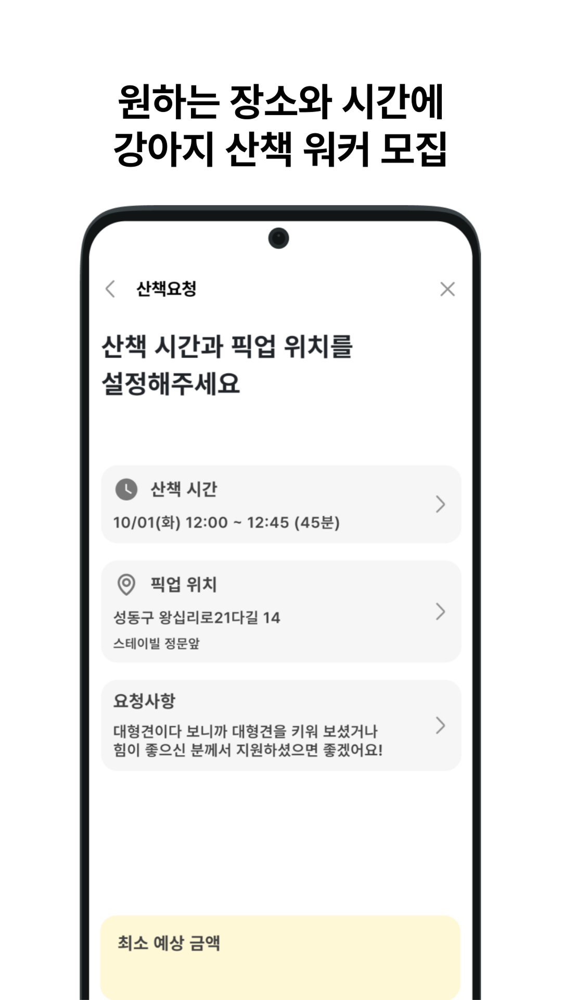
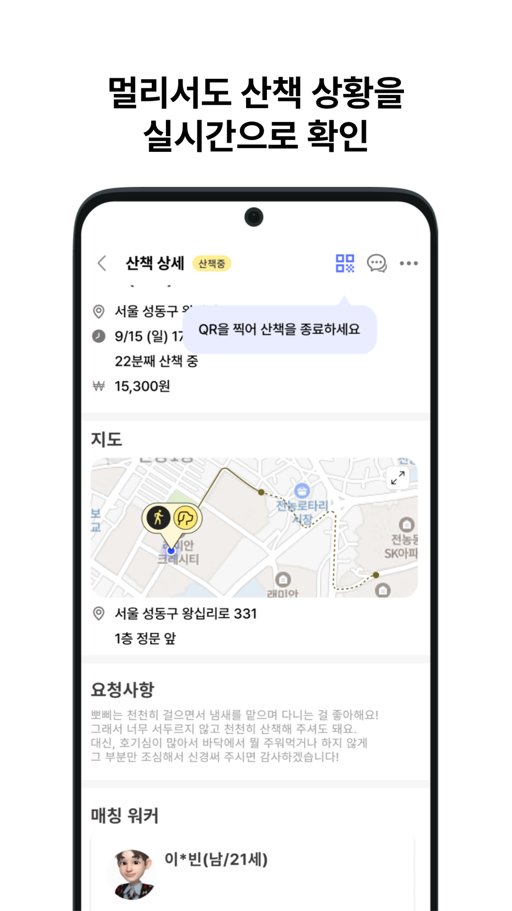
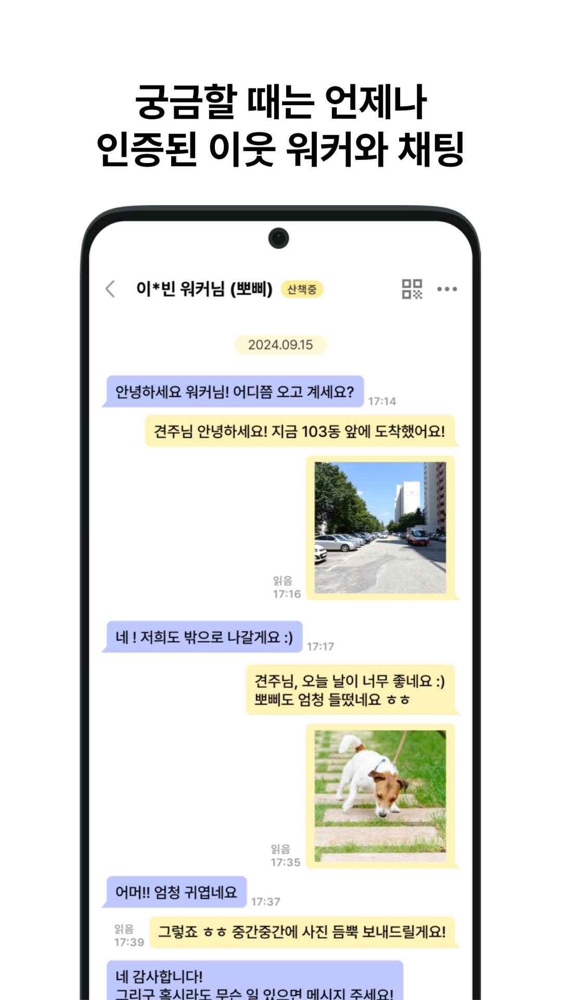
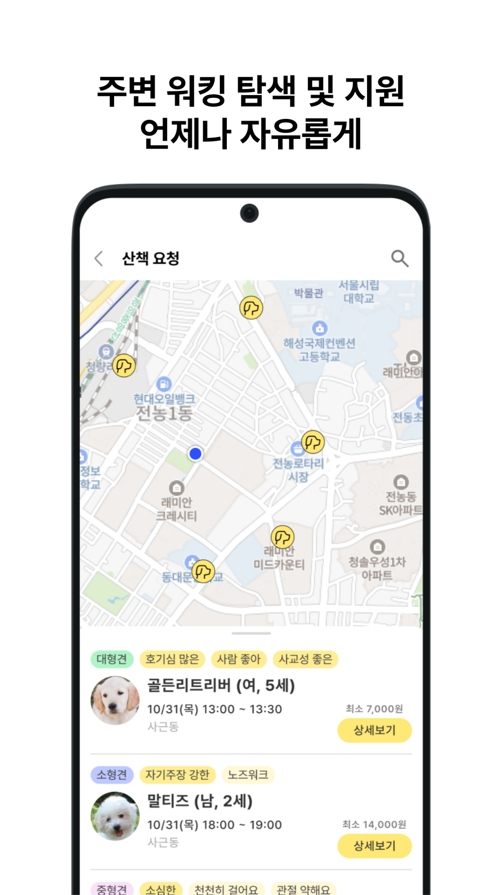
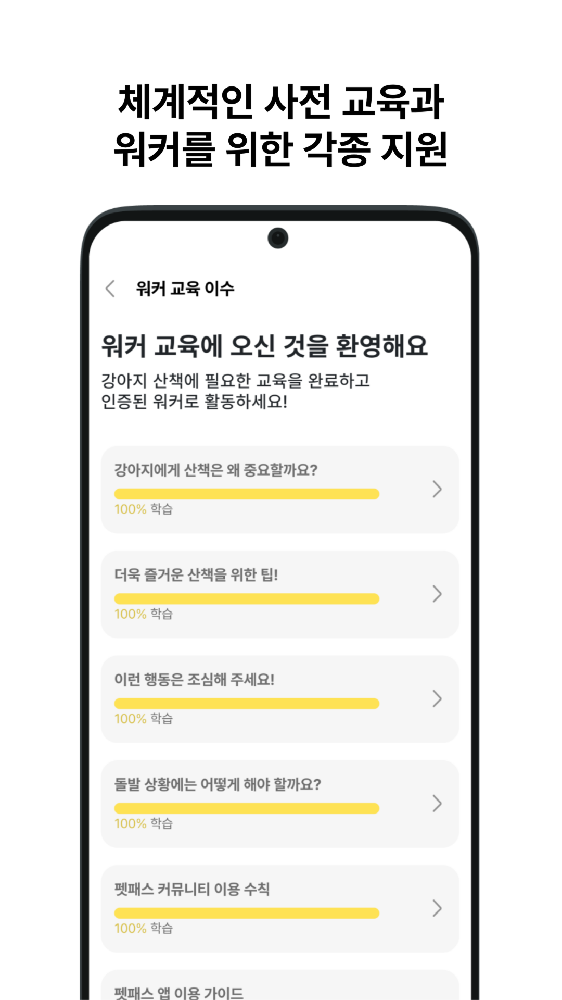

<div align="center">


# PetPath iOS

**강아지 산책이 필요할 때, 펫패스**

반려견 보호자와 이웃 워커를 연결하는 O2O 강아지 산책 플랫폼

[](https://swift.org)
[](https://developer.apple.com/ios/)
[](https://developer.apple.com/xcode/)

</div>

---

## 앱 소개

PetPath는 **반려견 보호자**와 **이웃 워커** 두 가지 역할로 운영되는 강아지 산책 O2O 서비스입니다.

보호자는 강아지 정보와 원하는 조건을 등록하고 산책을 요청할 수 있으며, 워커는 주변 산책 요청을 탐색하고 지원해 수익을 얻을 수 있습니다. 산책 중 실시간 위치 공유, 1:1 채팅, 정산 기능까지 산책의 전 과정을 앱 안에서 처리합니다.

---

## 주요 기능

### 보호자 (Owner)

| 홈화면 | 산책 요청 | 강아지 등록 |
|:---:|:---:|:---:|
|  |  |  |
| 진행 중인 산책 현황 및 내 강아지 관리 | 시간·픽업위치·반려견 조건 설정 | 크기·성격·특이사항 맞춤 등록 |

| 산책 실시간 확인 | 워커와 채팅 |
|:---:|:---:|
|  |  |
| 지도에서 워커 위치 실시간 추적 | 인증된 이웃 워커와 1:1 채팅 |

### 워커 (Walker)

| 산책 탐색 | 정산 | 워커 교육 |
|:---:|:---:|:---:|
|  |  |  |
| 주변 산책 요청 지도 기반 탐색 및 지원 | 누적 수익 확인 및 정산 신청 | 사전 교육 이수 후 인증 워커로 활동 |

---

## 기술 스택

### Language & Platform
| 항목 | 내용 |
|---|---|
| Language | Swift 5.9 |
| Minimum iOS | 14.0 |
| IDE | Xcode 15+ |

### Architecture
| 항목 | 내용 |
|---|---|
| 패턴 | MVVM + Clean Architecture |
| 레이어 | Presentation → Domain (UseCase) → Data (Repository) |
| 비동기 | Combine (`@Published` + `sink`), async/await |

### UI
| 항목 | 내용 |
|---|---|
| 프레임워크 | UIKit (코드 기반, Storyboard 미사용) |
| 레이아웃 | SnapKit |
| 데이터 | UITableViewDiffableDataSource, UICollectionViewDiffableDataSource |
| 이미지 | Kingfisher |
| 컴포넌트 | DropDown, Then |

### Networking & Backend
| 항목 | 내용 |
|---|---|
| HTTP | Moya + Alamofire |
| WebSocket | Socket.IO-Client-Swift, Starscream 4.0.4 |
| Push | Firebase Cloud Messaging (FCM) |
| Auth 저장 | Keychain |

### Location & Background
| 항목 | 내용 |
|---|---|
| 위치 | CoreLocation (Background Location Updates) |
| 위치 전송 | Combine publisher + Date 기반 3초 스로틀링 |
| 백그라운드 갱신 | BGTaskScheduler (BGAppRefreshTask) |

### 기타
| 항목 | 내용 |
|---|---|
| 지도 | KakaoMap SDK |
| 애널리틱스 | Firebase |
| 의존성 관리 | CocoaPods |

---

## 아키텍처

```
PetPath
├── Apps                        # AppDelegate, SceneDelegate
├── Core
│   └── Workers                 # LocationManager, BackgroundTaskManager, PushWalkPositionManager
├── Data
│   ├── DTO                     # API 응답 모델 (Codable)
│   ├── Network                 # Moya TargetType, NetworkManager
│   └── Repository              # Repository 구현체
├── Domain
│   ├── Entity                  # 도메인 모델
│   ├── Repository              # Repository 프로토콜
│   └── UseCase                 # 비즈니스 로직 (프로토콜 + 구현체)
└── Presentation                # ViewController + ViewModel + SubViews
    ├── OwnerMainPage           # 보호자 홈
    ├── WalkerMainPage          # 워커 홈
    ├── RequestWalk             # 산책 요청
    ├── FindWalk                # 산책 탐색 (워커)
    ├── OwnerWalkDetail         # 산책 상세 (보호자)
    ├── WalkerWalkDetail        # 산책 상세 (워커)
    ├── Chat                    # 1:1 채팅
    ├── AddDog / ManageDog      # 강아지 등록·관리
    ├── Payout / PayoutContract # 정산
    ├── Train                   # 워커 교육
    └── ...
```

---

## 주요 구현 사항

- **DiffableDataSource 전면 적용** — 모든 TableView / CollectionView를 `UITableViewDiffableDataSource` / `UICollectionViewDiffableDataSource`로 리팩토링. 삽입·삭제 애니메이션 품질 개선 및 데이터 충돌 방지
- **실시간 위치 추적** — `CLLocationManager` background location updates + Combine publisher로 워커 위치를 3초 간격 서버 전송. Timer 대신 Date 비교 방식으로 백그라운드에서도 안정적으로 동작
- **BGTaskScheduler** — 앱 백그라운드 진입 시 `BGAppRefreshTask`로 진행 중인 산책 정보 주기적 갱신, UserDefaults 캐싱으로 콜드 스타트 시 즉시 표시
- **Clean Architecture** — UseCase / Repository 인터페이스로 비즈니스 로직과 UI 완전 분리, 테스트 가능한 구조 유지
- **Combine 바인딩** — `@Published` + `sink`로 ViewModel → View 단방향 데이터 흐름, async/await 병행 사용
- **WebSocket 채팅** — Socket.IO 기반 실시간 1:1 채팅, 푸시 알림 수신 시 해당 채팅방으로 딥링크 이동
- **FCM 딥링크** — 알림 수신 시 `screen`, `id`, `accountType` 파라미터로 산책 상세 / 채팅 화면 직접 이동

---

## 설치 및 실행

1. 레포지토리 클론

```bash
git clone https://github.com/KimNahun/PetPath-iOS.git
cd PetPath-iOS
```

2. CocoaPods 의존성 설치

```bash
pod install
```

3. 시크릿 파일 추가 (`.gitignore`로 관리되어 별도 제공)

```
PetPath/Secrets.xcconfig       # BASE_URL, KAKAO_APP_KEY 등
PetPath/GoogleService-Info.plist  # Firebase 설정
```

4. `PetPath.xcworkspace`를 열어 빌드

---

## 라이선스

© 2025 PetPath. All rights reserved.
